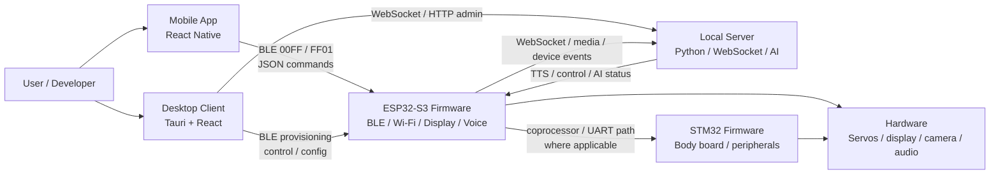

# Architecture

WatcheRobot is organized as a multi-repository system with a root meta workspace.

## Responsibilities

| Layer | Responsibility | Repository |
| --- | --- | --- |
| Root workspace | Entry docs, scripts, submodule references, open-source governance | `.` |
| Mobile App | BLE scan/connect/control/provisioning app | `WatcheRobot_app` |
| Desktop Client | Setup, hardware connection, AI configuration, runtime UI, packaging | `WatcheRobot_client` |
| Server | ASR / LLM / TTS / OpenClaw orchestration, WebSocket and HTTP APIs | `WatcheRobot_server` |
| ESP32-S3 | Device firmware, BLE, Wi-Fi, display animations, audio, camera, OTA path | `WatcheRobot_esp32` |
| STM32 | Body-board firmware, local peripherals, protocol bring-up path | `WatcheRobot_stm32` |

## Notes

- The ESP32 firmware has a BLE JSON-over-GATT path documented in `WatcheRobot_esp32/firmware/s3/docs/BLE_GATT_PROTOCOL_BRIDGE.md`.
- The server has bilingual docs under `WatcheRobot_server/docs/`.
- STM32 is documented as a staged bring-up path and should not be described as fully complete unless verified against its current README.
